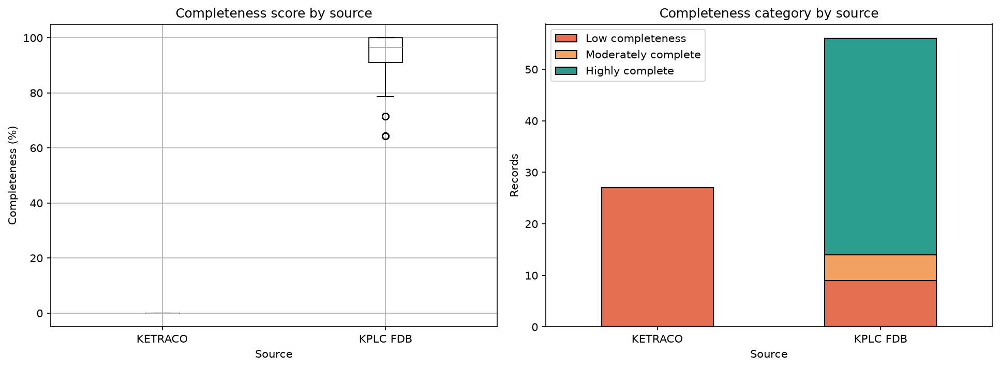
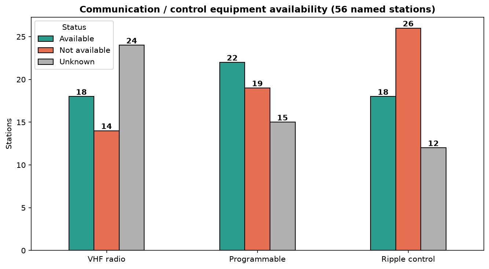

# Kenya Transmission Stations: Data Quality Audit & Exploratory Analysis

A reproducible pipeline that audits, cleans and profiles a registry of **83 Kenyan electricity transmission station records**: flattening the GeoJSON source, documenting every quality issue found, and producing a cleaned, analysis-ready dataset.

> **Status:** Part 1 of a longer energy-infrastructure project (data quality and EDA). [Future phases will build on this cleaned dataset through grid digitalization and operational-exposure analysis, followed by geospatial/network analysis and integration with additional energy datasets to explore infrastructure planning and decision support.]




## Why this matters
Energy analysis is only as reliable as the underlying registers. This project shows how I turn a fragmented, inconsistently coded infrastructure dataset into a documented, auditable one: the same workflow needed to prepare data for dashboards, country profiles and policy analysis.

## Key findings
- **Missingness is structural, not random.** 27 KETRACO records contain coordinates only (0% attribute completeness); the 56 KPLC FDB records average ~90% complete.
- **7 records carry a placeholder date** (`01/01/2000`), treated as "unknown" and flagged rather than kept.
- **No full-row duplicates**, but KAMBURU and LESSOS legitimately appear twice (separate multi-voltage facilities a few hundred metres apart); this is only detectable after name normalisation.
- **Inconsistent coding fixed:** `"0"` vs `"NO"` (VHF radio), `"NONE"` owner, case/whitespace drift, a `22OKV` typo, non-standard voltage notation.
- **Operational gaps (56 named stations):** 39 manned, 38 with remote monitoring; VHF radio is the least available channel (18 yes, 14 no, 24 unknown).

## Repository structure
```
├── data/
│   ├── RAW/          # original GeoJSON, never modified
│   ├── INTERIM/      # flattened CSV produced from the raw file
│   └── PROCESSED/    # cleaned, feature-engineered dataset
├── notebooks/
│   └── 01_kenya_transmission_data_quality.ipynb
├── docs/
│   └── data_dictionary.md   # source, field definitions, cleaning log
├── reports/figures/  # exported charts
├── requirements.txt
└── README.md
```

## Methods
1. **Flatten** GeoJSON to a table (properties + x/y coordinates, CRS EPSG:32737).
2. **Profile**: nulls, blank strings, categorical values, duplicates, date validity, voltage notation.
3. **Clean**: documented rules, each tied to a finding (see `docs/data_dictionary.md`).
4. **Engineer features**: parsed dates, `max_voltage_kv`, `base_name`, per-station completeness score.
5. **Explore**: counts by county, owner, voltage, control area, staffing, monitoring, communications, access.

## Data source
**Kenya - Transmission Stations**, published on [ENERGYDATA.INFO](https://energydata.info/dataset/kenya-transmission-stations) (World Bank Group / ESMAP). The data was provided by Kenya Power and Lighting Company (KPLC) . Released 2020, page last updated 24 November 2025. Licensed **CC0 1.0** (public domain), so the raw file is included in this repository. Date downloaded: [5/5/2026]. Full details in `docs/data_dictionary.md`.

## How to run
```bash
git clone https://github.com/PriscillaKungu/kenya-transmission-data-quality.git
cd kenya-transmission-data-quality
python -m venv .venv && source .venv/bin/activate   # Windows: .venv\Scripts\activate
pip install -r requirements.txt
jupyter lab notebooks/01_kenya_transmission_data_quality.ipynb
```

## Skills demonstrated
Python (pandas, NumPy, regex, datetime), data cleaning and reconciliation, missing-data analysis, feature engineering, visualisation (matplotlib, seaborn), documentation and reproducibility.

## Limitations
- Cleaned values are only as good as the source; unresolved gaps are flagged, not imputed.
- Completeness thresholds (90/70%) are analytical choices for this project, not industry standards.
- This analysis describes infrastructure and data-quality characteristics; it does not assess electrical reliability, station criticality, equipment condition, or failure probability.

## Author
Priscilla Kungu · Mechanical Engineer & Junior Data Scientist · Nairobi, Kenya
[[LinkedIn](https://www.linkedin.com/in/priscilla-kung-u-9a6064102/)] · [priscilla.w.kungu@gmail.com]
